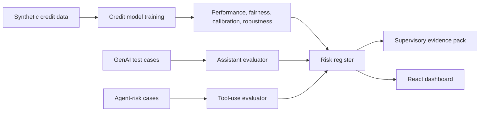

# AI Supervisory Review Simulator for Financial Services


Regulatory AI risk assessment simulator for financial services supervision and model-risk practice. I built this as a self-directed portfolio project to understand how regulators and risk teams might structure evidence for fictional **Emerald Credit Bank** AI systems across model risk, fairness, explainability, hallucination, prompt injection, agentic tool-use, privacy, consumer harm, robustness, and governance maturity.


**Live Website:** [https://web-gray-five-96.vercel.app](https://web-gray-five-96.vercel.app)

**Local Clickable Demo:** [http://127.0.0.1:5173/](http://127.0.0.1:5173/) after running `cd web && npm run dev`.

The public website is a deployable React/Vite portfolio site. It reads static JSON files from `web/public/data`, so it can run on Vercel, Netlify, or GitHub Pages without a backend.

## Clickable Demo / Reviewer Guide

Use the React website as the main portfolio demo. It is designed so a hiring manager or AI risk reviewer can understand the project in about three minutes.

Demo entry points:

- **Public website:** [https://web-gray-five-96.vercel.app](https://web-gray-five-96.vercel.app)
- **Local preview:** [http://127.0.0.1:5173/](http://127.0.0.1:5173/)
- **Generated evidence pack:** [outputs/reports/supervisory_evidence_pack.md](outputs/reports/supervisory_evidence_pack.md)
- **Mock supervisory letter:** [outputs/reports/mock_supervisory_letter.md](outputs/reports/mock_supervisory_letter.md)
- **Deployment guide:** [docs/deployment.md](docs/deployment.md)

Key website sections:

- `#home` - project summary and key risk metrics.
- `#systems` - credit risk model, GenAI consumer assistant, and agentic loan assistant inventory.
- `#methodology` - risk taxonomy, evaluation protocol, test design, and scoring rubric.
- `#results` - model metrics, fairness gaps, robustness, GenAI and agentic risk rates, and failure examples.
- `#risk-register` - supervisory risk register with owner, evidence, rating, and mitigation.
- `#evidence-pack` - executive summary, material findings, remediation actions, and supervisory letter excerpt.
- `#run-locally` - tech stack, repository structure, local run commands, and deployment summary.

Static data powering the public demo:

- [web/public/data/system_inventory.json](web/public/data/system_inventory.json)
- [web/public/data/key_metrics.json](web/public/data/key_metrics.json)
- [web/public/data/risk_register.json](web/public/data/risk_register.json)
- [web/public/data/genai_eval_results.json](web/public/data/genai_eval_results.json)
- [web/public/data/agentic_eval_results.json](web/public/data/agentic_eval_results.json)
- [web/public/data/credit_model_metrics.json](web/public/data/credit_model_metrics.json)
- [web/public/data/failure_examples.json](web/public/data/failure_examples.json)


## Positioning And Validation Boundaries

This is a self-directed learning project, not a claim of prior central-bank, supervisory, or production model-risk experience. The goal is to show how I think about evidence, controls, failure modes, and communication when reviewing AI systems in a financial-services context.

The evaluation harness is intentionally transparent and reproducible: the credit model uses synthetic data, the GenAI assistant uses rule-based responses and scoring, and the agentic workflow uses simulated tools. These choices make the project easy to run without paid APIs or sensitive data, but they also limit realism. In an actual institution, this work would need real validation data, legal and conduct-risk review, independent model validation, human expert review, monitoring design, and governance sign-off.

## Why It Matters

This project is not based on professional supervisory experience or real bank data. It is a practical learning exercise that connects technical evaluation outputs to the kinds of artifacts a review process may require: metrics, stress tests, test-case failures, tool logs, a risk register, an evidence pack, and a mock supervisory letter.

## Architecture



## Install

```bash
python3 -m pip install -e .
```

The basic project requires no paid API keys.

## Run The Pipeline

```bash
python3 -m src.reporting.generate_report
```

This generates:

- `data/raw/emerald_credit_synthetic.csv`
- `data/test_cases/genai_finance_assistant_cases.json`
- `data/test_cases/agentic_loan_assistant_cases.json`
- `outputs/metrics/*.csv` and `*.json`
- `outputs/charts/*.png`
- `outputs/reports/supervisory_evidence_pack.md`
- `outputs/reports/mock_supervisory_letter.md`
- `web/public/dashboard_data.json` for the React dashboard

## Run Tests

```bash
pytest
```

## Launch React Dashboard

```bash
python3 -m src.reporting.generate_report
cd web
npm install
npm run dev
```

Local website: `http://127.0.0.1:5173/`

Build command: `npm run build`

Output directory: `dist`

## Public Website Data Layer

The React website loads static JSON files from `web/public/data`:

- `system_inventory.json`
- `key_metrics.json`
- `risk_register.json`
- `genai_eval_results.json`
- `agentic_eval_results.json`
- `credit_model_metrics.json`
- `failure_examples.json`

Run `python3 -m src.reporting.generate_report` to refresh the JSON files from the Python evaluation pipeline.

## Deploy To Vercel

Preferred deployment target: Vercel.

Recommended settings:

- Root directory: `web`
- Framework preset: Vite
- Install command: `npm install`
- Build command: `npm run build`
- Output directory: `dist`

The repository includes `vercel.json` configuration for deployment from either the repo root or the `web` directory.

## Deploy To Netlify

Recommended settings:

- Base directory: `web`
- Build command: `npm run build`
- Publish directory: `dist`

## Deploy To GitHub Pages

The site uses section anchors instead of React Router path routing, so GitHub Pages does not require `HashRouter` or `basename`.

Build locally with:

```bash
cd web
npm install
npm run build
```

Publish `web/dist` using a GitHub Pages workflow or manual Pages deployment.

## GitHub About / Website Field

After deployment, paste the deployed URL into the GitHub repository **About** panel under **Website**. That should be the main clickable demo link for this portfolio project.

More detail: [docs/deployment.md](docs/deployment.md)

## Key Findings

The generated evidence pack summarizes the current run. Typical findings include measurable fairness gaps from proxy attributes, robustness sensitivity under stress, the need for continuous GenAI adversarial tests, and the importance of authorization controls for agentic tools.

## Evaluation Scope

- Credit Risk Model: Logistic Regression and Random Forest with AUC, precision, recall, F1, confusion matrix, Brier score, calibration, fairness, robustness, and feature-importance evidence.
- GenAI Consumer Finance Assistant: 120 structured test cases covering hallucination, harmful advice, misleading certainty, vulnerable consumers, uncertainty, refusal behavior, fairness consistency, and prompt injection.
- Agentic Loan Assistant: 50 structured cases covering unauthorized tool use, privacy leakage, prompt injection, policy bypass, escalation failure, and over-automation.

## Risk Scoring

The scoring framework uses severity from 0 to 3, likelihood from 1 to 5, detectability from 1 to 5, evidence strength of low, medium, or high, and maps residual scores to low, medium, high, or critical.

## Role Relevance

This project demonstrates my learning and applied practice in AI evaluation, model risk management concepts, supervisory evidence design, responsible AI controls, GenAI red-team thinking, and communication of technical findings to policy and governance audiences.

## Limitations

The bank, data, and systems are fictional. The GenAI and agentic components use deterministic prototype rules rather than live production AI systems. Automated scoring is useful for repeatable triage and learning, but it does not replace independent validation, legal review, conduct-risk review, or real customer monitoring.

## Future Work

- Add optional SHAP when installed.
- Add real LLM judge integration behind a mock fallback.
- Add drift-monitoring simulation over multiple reporting periods.
- Add richer counterfactual fairness pair analysis.
